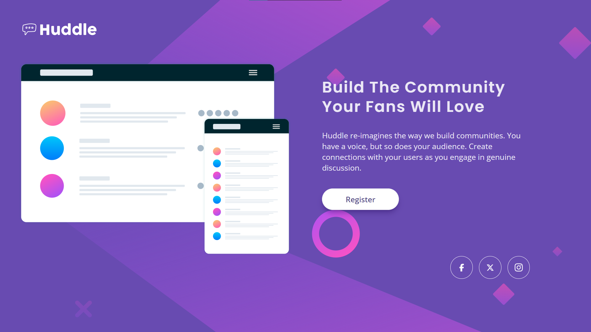
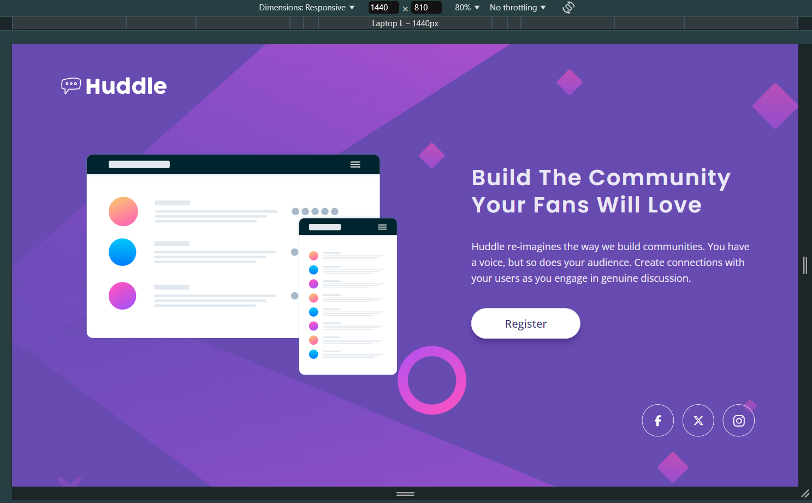
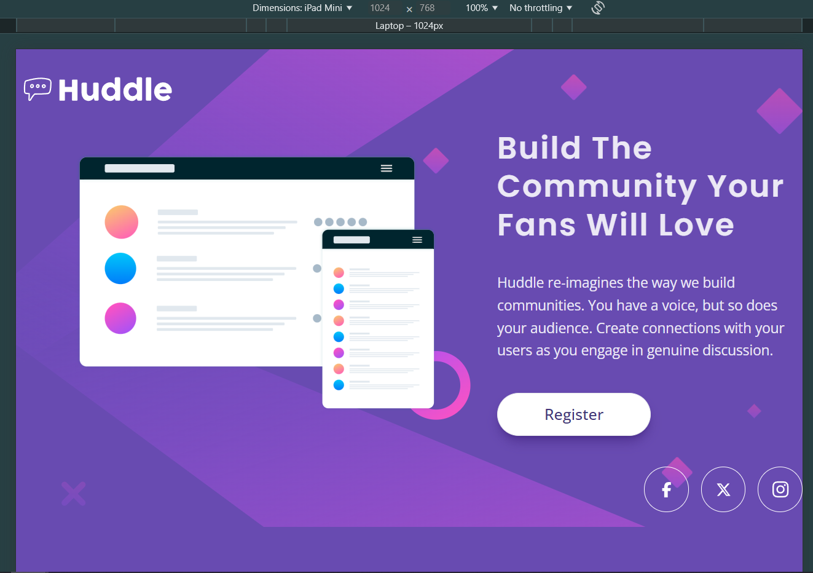
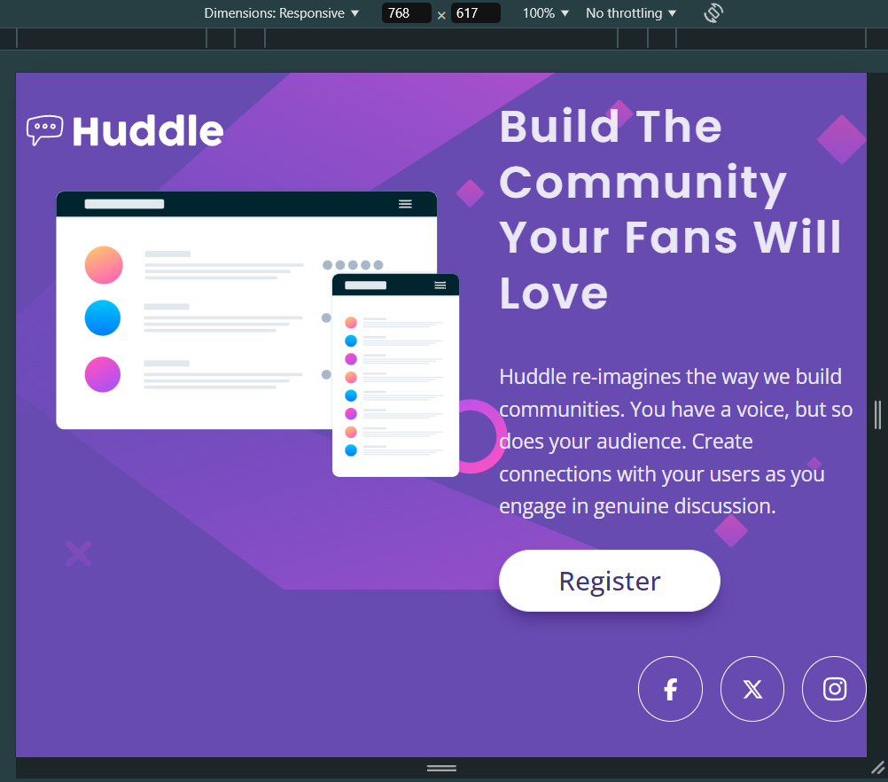
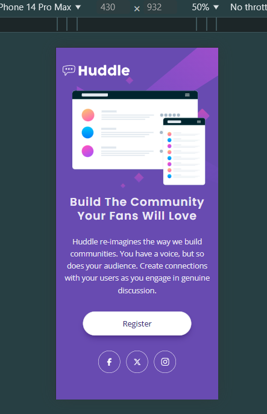
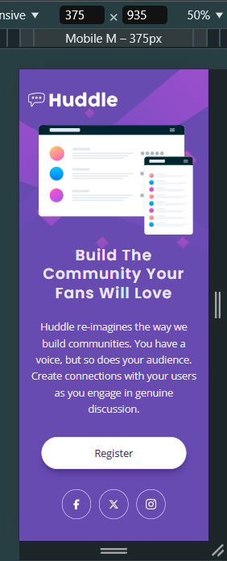
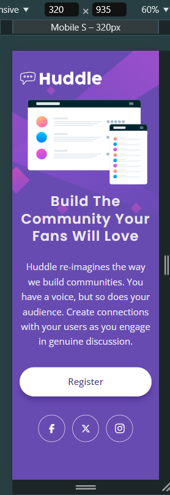

# Frontend Mentor - Huddle Landing Page

This is a solution to the [Huddle landing page coding challenge on Frontend Mentor](https://www.frontendmentor.io/challenges/huddle-landing-page-with-a-single-introductory-section-B_2Wvxgi0).

Frontend Mentor challenges help improve skills by building realistic projects.

## Table of contents:

- [Overview](#overview)
  - [The challenge](#the-challenge)
  - [Screenshot](#screenshots)
  - [Links](#links)
- [My process](#my-process)
  - [Built with](#built-with)
  - [What I learned](#what-i-learned)
- [Author](#author)

## Overview:

### The challenge:

**To do this challenge, you need a basic understanding of HTML, CSS and a tiny bit of JavaScript.**
Users should be able to:

- View the optimal layout depending on their device's screen size
- Get it looking as close to the design as possible.
- See a hover state on desktop

 

Preview of initial design:

### Screenshots:

| Fullscreen View (Desktop)                           |
| --------------------------------------------------- |
|  |

| Animated Preview                                          |
| --------------------------------------------------------- |
| 

 |

 

**Note: This is a Mobile-First Approach & Wait for the GIF to load**

 

All viewports were included (except for the 4k view), in case the observer wishes to see the minor changes.

 

| Desktop View (1440px)                              | Laptop View (1024px)                              | Tablet View (768px)                               |
| -------------------------------------------------- | ------------------------------------------------- | ------------------------------------------------- |
|  |  |  |

| Mobile L (430px)                                   | Mobile M (375px)                                   | Mobile S (320px)                                   |
| -------------------------------------------------- | -------------------------------------------------- | -------------------------------------------------- |
|  |  |  |

### Links:

- Live Site URL: [Website Link - Click Me](https://mark-siazon.github.io/FM-Huddle-Landing-Page/)
- Solution URL: [FrontEndMentor - Click Me](https://www.frontendmentor.io/solutions/huddle-landing-page-responsive-mobile-first-tsreactvitetailwind-IMYatKoHe7)

## My process:

### Built with:

- HTML5, CSS3, JS
- Figma / Mobile-First Approach
  - Flexbox Layout + Responsive Web Design
- React JS
- Tailwind CSS
- Typescript
- PostCSS
- Vite JS Webpack

### What I learned:

Recap over some of the major learnings while working through this project:

#### General things I've learned:

- Review of Semantic HTML & CSS, CSS Flex Layout
- Solidify more basic React Integration & Tailwind Usage
- Writing DRY code by combining similar styles

## Author:

- Github - [@Iron-Mark](https://github.com/Iron-Mark)
- Github - [@Mark-Siazon](https://github.com/Mark-Siazon)
- Frontend Mentor - [@Iron-Mark](https://www.frontendmentor.io/profile/Iron-Mark)
  - _(The Assets used in this project is originally from FrontendMentor)_
